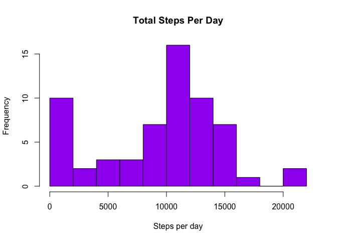
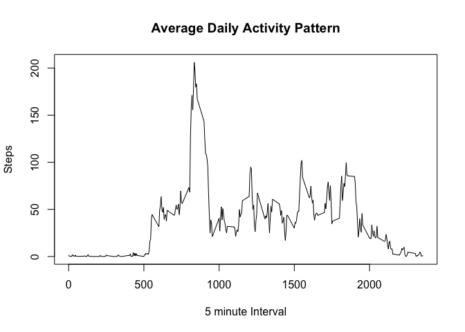
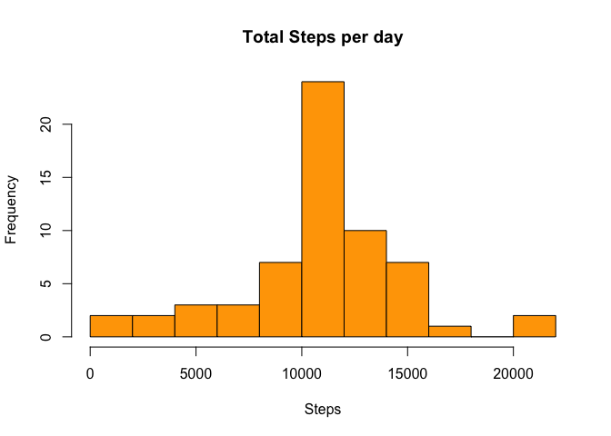
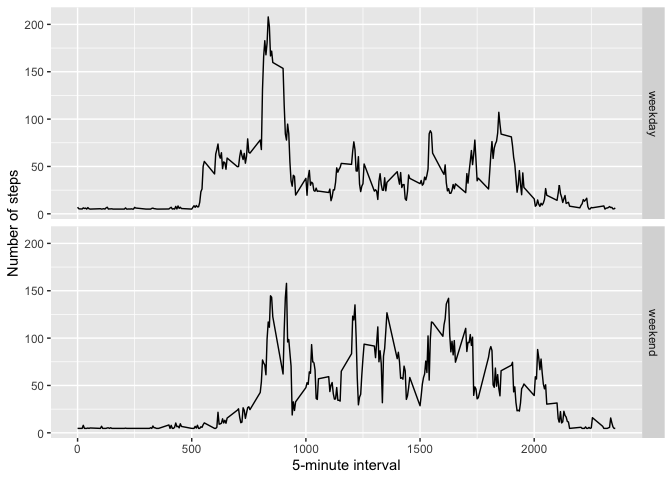

## Loading and preprocessing the data

```r
data_file <- "activity.zip"
unzip(data_file)
data <- read.csv("activity.csv", header = TRUE, sep = ",")
```


## What is mean total number of steps taken per day?

```r
TotalStepsPerDay <- tapply(data$steps, data$date, FUN = sum, na.rm = TRUE)
```


```r
hist(TotalStepsPerDay, col = "purple", xlab = "Steps per day", breaks =10, main = "Total Steps Per Day")
```

<!-- -->


```r
mean(TotalStepsPerDay, na.rm=TRUE)
```

```
## [1] 9354.23
```

```r
median(TotalStepsPerDay, na.rm = TRUE)
```

```
## [1] 10395
```
## What is the average_daily_activity_pattern?

```r
averagePattern <- aggregate(x=list(steps=data$steps), by= list(Interval = data$interval), FUN = "mean" , na.rm=TRUE) 
plot(averagePattern$Interval,averagePattern$steps, type = "l", xlab= "5 minute Interval", ylab="Steps", main="Average Daily Activity Pattern")
```

<!-- -->
# Which 5-minute interval, on average across all the days in the dataset, contains the maximum number of steps?

```r
averagePattern[which.max(averagePattern$steps),]
```

```
##     Interval    steps
## 104      835 206.1698
```

## Imputing missing values

# Total number of missing values in the dataset 

```r
sum(is.na(data$steps))
```

```
## [1] 2304
```

# There are many missing values in data noted as NA. So, to fill the missing values we take the mean of that column and substitue NA with mean

```r
data$steps[is.na(data$steps)] <- mean(data$steps, na.rm = TRUE)
```
# Create a histogram using new data with filled values

```r
Steps_impute <- tapply(data$steps, data$date, FUN = sum)
hist(Steps_impute, xlab="Steps", main="Total Steps per day", breaks = 10, col = "orange")
```

<!-- -->


```r
mean(Steps_impute)
```

```
## [1] 10766.19
```

```r
median(Steps_impute)
```

```
## [1] 10766.19
```
Mean and Median Values increased after imputing missing values 

## Are there differences in activity patterns between weekdays and weekends?


```r
week <- function(date) {
        day <- weekdays(date)
       ifelse(day %in% c("Saturday", "Sunday"), "weekend", "weekday")
}
data$date <- as.Date(data$date)
data$day <- sapply(data$date, FUN = week)
```

Plot containing a time series plot (i.e. type = "l") of the 5-minute interval (x-axis) and the average number of steps taken, averaged across all weekday days or weekend days (y-axis)

```r
average_day <- aggregate(steps~ interval+day, data = data , mean)
library(ggplot2)
ggplot(average_day, aes(interval,steps)) + geom_line() + facet_grid(day~.) + xlab("5-minute interval") + ylab("Number of steps")
```

<!-- -->
